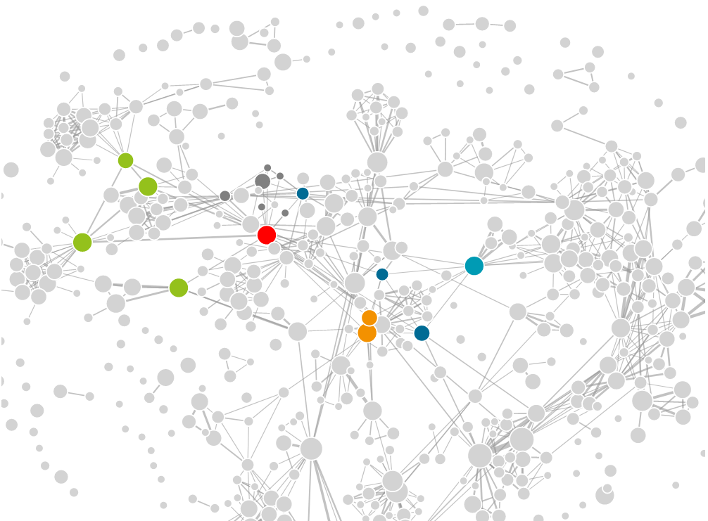
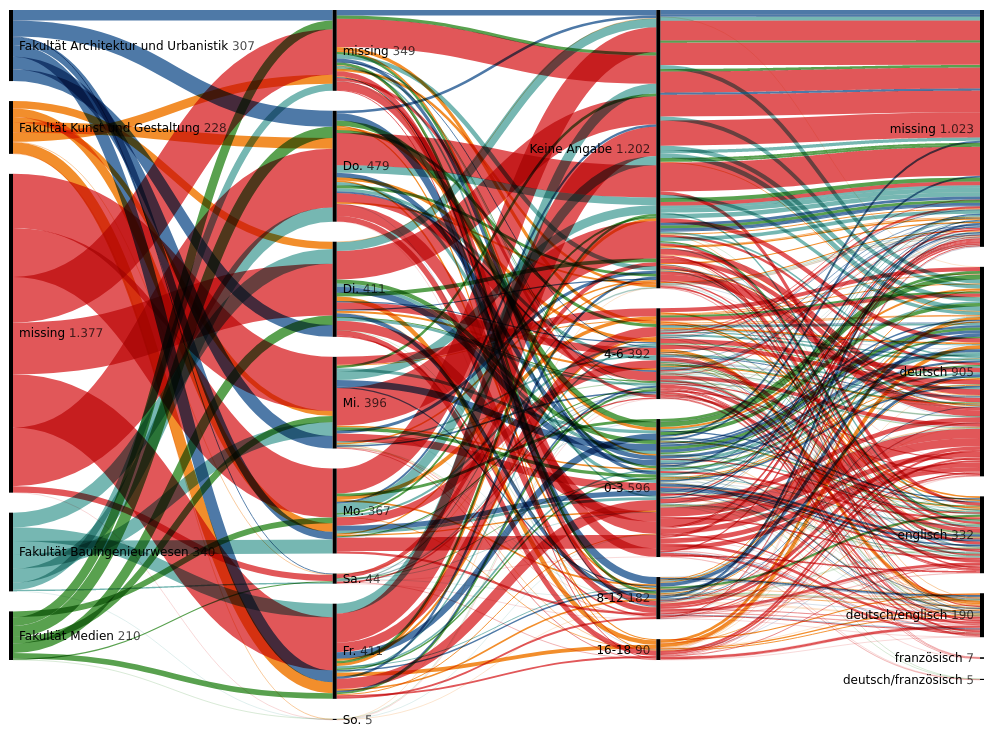
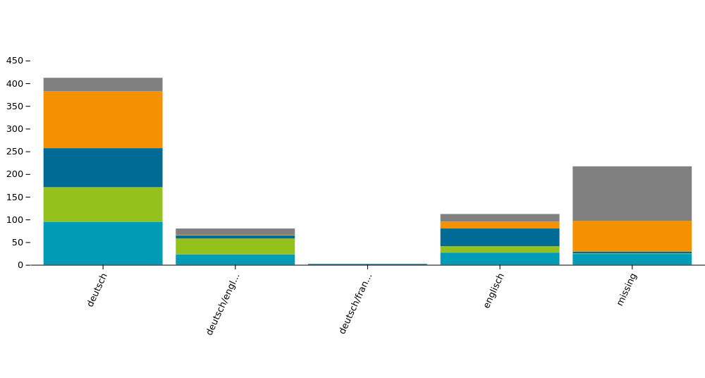

Interface for visualizing and exploring the Bauhaus university's course catalog
## Features
The interface supports various visualizations.

### Lecturer Network

The "Lecturer Network" is a weighted graph displaying lecturers as nodes and collaborative courses as edges. It features a search interface to filter for specific  persons.

### Selector

The "Selector" is based on a Sankey diagram and helps the user to choose courses based on various requirements like SWS, Course type, day, language and more.

### Stacked Bar Chart

In a stacked bar chart the user can choose and compare different attributes between the university's faculties.

## Install
Run `npm install` to install the required packages.
During development run `npm run dev` to locally serve the site and automatically refresh it on file changes.

Run `npm run format` to format all JavaScript files.
